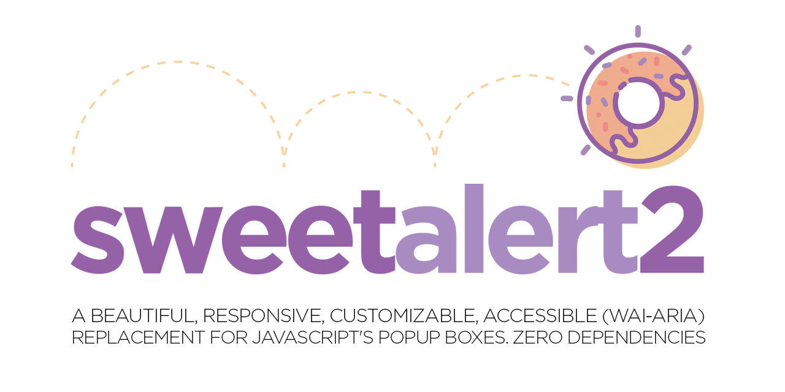

<h1 align="center">Namaste :pray:, I'm Erik Lewis 🤖</h1>
<h3 align="center"><a href="https://www.w3schools.com/whatis/whatis_fullstack.asp" target="_blank">Full Stack Web Developer</a> skilled in <a href="https://dev.to/theme_selection/best-web-development-stack-2jpe" target="_blank">MERN, MEAN, MEVN, PERN, LAMP, Flutter and also Ruby On Rails Tech STACK
</a> who focuses on writing neat, clean, elegant and efficient code.</h3>

  

 <b>Github Profile Trophy</b>

  

- 🔭 I’m currently working on **Full Stack Web Development**

- 🌱 I’m currently learning **React, Redux**

- 👨‍💻 All of my projects are available

- 💬 Ask me about **Html, CSS, Javascript, React**

- 📫 How to reach me **eriksimaremare@gmail.com**

<h3 align="left">Connect with me:</h3>

 <h4 dir="auto"><a id="user-content-checkout-my-portfolio" class="anchor" aria-hidden="true" href="#checkout-my-portfolio"><svg class="octicon octicon-link" viewBox="0 0 16 16" version="1.1" width="16" height="16" aria-hidden="true"><path fill-rule="evenodd" d="M7.775 3.275a.75.75 0 001.06 1.06l1.25-1.25a2 2 0 112.83 2.83l-2.5 2.5a2 2 0 01-2.83 0 .75.75 0 00-1.06 1.06 3.5 3.5 0 004.95 0l2.5-2.5a3.5 3.5 0 00-4.95-4.95l-1.25 1.25zm-4.69 9.64a2 2 0 010-2.83l2.5-2.5a2 2 0 012.83 0 .75.75 0 001.06-1.06 3.5 3.5 0 00-4.95 0l-2.5 2.5a3.5 3.5 0 004.95 4.95l1.25-1.25a.75.75 0 00-1.06-1.06l-1.25 1.25a2 2 0 01-2.83 0z"></path></svg></a>My <a href="https://eriklewis95.github.io/Portfolio/" rel="nofollow">Portfolio</a></h4>
 
 
<h2 dir="auto"><a id="user-content-️-my-skills" class="anchor" aria-hidden="true" href="#️-my-skills"><svg class="octicon octicon-link" viewBox="0 0 16 16" version="1.1" width="16" height="16" aria-hidden="true"><path fill-rule="evenodd" d="M7.775 3.275a.75.75 0 001.06 1.06l1.25-1.25a2 2 0 112.83 2.83l-2.5 2.5a2 2 0 01-2.83 0 .75.75 0 00-1.06 1.06 3.5 3.5 0 004.95 0l2.5-2.5a3.5 3.5 0 00-4.95-4.95l-1.25 1.25zm-4.69 9.64a2 2 0 010-2.83l2.5-2.5a2 2 0 012.83 0 .75.75 0 001.06-1.06 3.5 3.5 0 00-4.95 0l-2.5 2.5a3.5 3.5 0 004.95 4.95l1.25-1.25a.75.75 0 00-1.06-1.06l-1.25 1.25a2 2 0 01-2.83 0z"></path></svg></a><g-emoji class="g-emoji" alias="hammer_and_wrench" fallback-src="https://github.githubassets.com/images/icons/emoji/unicode/1f6e0.png">🛠️</g-emoji> My Skills</h2>
<h3 dir="auto"><a id="user-content--programming-languages" class="anchor" aria-hidden="true" href="#-programming-languages"><svg class="octicon octicon-link" viewBox="0 0 16 16" version="1.1" width="16" height="16" aria-hidden="true"><path fill-rule="evenodd" d="M7.775 3.275a.75.75 0 001.06 1.06l1.25-1.25a2 2 0 112.83 2.83l-2.5 2.5a2 2 0 01-2.83 0 .75.75 0 00-1.06 1.06 3.5 3.5 0 004.95 0l2.5-2.5a3.5 3.5 0 00-4.95-4.95l-1.25 1.25zm-4.69 9.64a2 2 0 010-2.83l2.5-2.5a2 2 0 012.83 0 .75.75 0 001.06-1.06 3.5 3.5 0 00-4.95 0l-2.5 2.5a3.5 3.5 0 004.95 4.95l1.25-1.25a.75.75 0 00-1.06-1.06l-1.25 1.25a2 2 0 01-2.83 0z"></path></svg></a><g-emoji class="g-emoji" alias="point_right" fallback-src="https://github.githubassets.com/images/icons/emoji/unicode/1f449.png"></g-emoji> Programming languages</h3>

<table >
        <tr>
         <td align="center"><b>LANGUAGES</b></td>
         <td align="center"><b>FRAMEWORKS</b></td>
        </tr>
        <tr>
            <td align="center"></td>
         <td align="center"><b>Angular, React, Backbone.js, etc</b></td>
        </tr>
        <tr>
            <td align="center"></a></td>
            <td align="center"><b>Codeigniter, Laravel, Yii, etc</b></td>
        </tr>
        <tr>
            <td align="center"></td>
            <td align="center"><b>Spring MVC, JSF, Struts, etc</b></td>
        </tr>
        <tr>
            <td align="center"></td>
            <td align="center"><b>Django, Cherry, Py, etc</b></td>
        </tr>
        <tr>
            <td align="center"></td>
            <td align="center"><b>Ruby on Rails, Sinatra, etc</b></td>
        </tr>
    </table>
    

<h3 dir="auto"><a id="user-content--frontend-development" class="anchor" aria-hidden="true" href="#-frontend-development"><svg class="octicon octicon-link" viewBox="0 0 16 16" version="1.1" width="16" height="16" aria-hidden="true"><path fill-rule="evenodd" d="M7.775 3.275a.75.75 0 001.06 1.06l1.25-1.25a2 2 0 112.83 2.83l-2.5 2.5a2 2 0 01-2.83 0 .75.75 0 00-1.06 1.06 3.5 3.5 0 004.95 0l2.5-2.5a3.5 3.5 0 00-4.95-4.95l-1.25 1.25zm-4.69 9.64a2 2 0 010-2.83l2.5-2.5a2 2 0 012.83 0 .75.75 0 001.06-1.06 3.5 3.5 0 00-4.95 0l-2.5 2.5a3.5 3.5 0 004.95 4.95l1.25-1.25a.75.75 0 00-1.06-1.06l-1.25 1.25a2 2 0 01-2.83 0z"></path></svg></a><g-emoji class="g-emoji" alias="point_right" fallback-src="https://github.githubassets.com/images/icons/emoji/unicode/1f449.png"></g-emoji> Frontend Development</h3>

     
 

 
 
  

<h3 dir="auto"><a id="user-content--backend-development" class="anchor" aria-hidden="true" href="#-backend-development"><svg class="octicon octicon-link" viewBox="0 0 16 16" version="1.1" width="16" height="16" aria-hidden="true"><path fill-rule="evenodd" d="M7.775 3.275a.75.75 0 001.06 1.06l1.25-1.25a2 2 0 112.83 2.83l-2.5 2.5a2 2 0 01-2.83 0 .75.75 0 00-1.06 1.06 3.5 3.5 0 004.95 0l2.5-2.5a3.5 3.5 0 00-4.95-4.95l-1.25 1.25zm-4.69 9.64a2 2 0 010-2.83l2.5-2.5a2 2 0 012.83 0 .75.75 0 001.06-1.06 3.5 3.5 0 00-4.95 0l-2.5 2.5a3.5 3.5 0 004.95 4.95l1.25-1.25a.75.75 0 00-1.06-1.06l-1.25 1.25a2 2 0 01-2.83 0z"></path></svg></a><g-emoji class="g-emoji" alias="point_right" fallback-src="https://github.githubassets.com/images/icons/emoji/unicode/1f449.png"></g-emoji> Backend Development</h3>

 

 
  
<h3 dir="auto"><a id="user-content--databases--cloud-hosting" class="anchor" aria-hidden="true" href="#-databases--cloud-hosting"><svg class="octicon octicon-link" viewBox="0 0 16 16" version="1.1" width="16" height="16" aria-hidden="true"><path fill-rule="evenodd" d="M7.775 3.275a.75.75 0 001.06 1.06l1.25-1.25a2 2 0 112.83 2.83l-2.5 2.5a2 2 0 01-2.83 0 .75.75 0 00-1.06 1.06 3.5 3.5 0 004.95 0l2.5-2.5a3.5 3.5 0 00-4.95-4.95l-1.25 1.25zm-4.69 9.64a2 2 0 010-2.83l2.5-2.5a2 2 0 012.83 0 .75.75 0 001.06-1.06 3.5 3.5 0 00-4.95 0l-2.5 2.5a3.5 3.5 0 004.95 4.95l1.25-1.25a.75.75 0 00-1.06-1.06l-1.25 1.25a2 2 0 01-2.83 0z"></path></svg></a><g-emoji class="g-emoji" alias="point_right" fallback-src="https://github.githubassets.com/images/icons/emoji/unicode/1f449.png"></g-emoji>Deployed On</h3>

 
 

<h3 dir="auto"><a id="user-content--software--tools" class="anchor" aria-hidden="true" href="#-software--tools"><svg class="octicon octicon-link" viewBox="0 0 16 16" version="1.1" width="16" height="16" aria-hidden="true"><path fill-rule="evenodd" d="M7.775 3.275a.75.75 0 001.06 1.06l1.25-1.25a2 2 0 112.83 2.83l-2.5 2.5a2 2 0 01-2.83 0 .75.75 0 00-1.06 1.06 3.5 3.5 0 004.95 0l2.5-2.5a3.5 3.5 0 00-4.95-4.95l-1.25 1.25zm-4.69 9.64a2 2 0 010-2.83l2.5-2.5a2 2 0 012.83 0 .75.75 0 001.06-1.06 3.5 3.5 0 00-4.95 0l-2.5 2.5a3.5 3.5 0 004.95 4.95l1.25-1.25a.75.75 0 00-1.06-1.06l-1.25 1.25a2 2 0 01-2.83 0z"></path></svg></a><g-emoji class="g-emoji" alias="point_right" fallback-src="https://github.githubassets.com/images/icons/emoji/unicode/1f449.png"></g-emoji>|Software|Tools|AI Integrator</h3>

  

<a target="_blank" rel="noopener noreferrer nofollow" href="https://replit.com/">
 
<a target="_blank" rel="noopener noreferrer nofollow" href="https://www.atlassian.com/software/">
 

</a>  

&nbsp;

